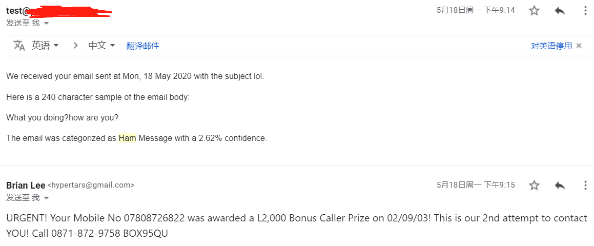

# Spam-Tagging-System

- Collection: AWS-based serverless cloud applications
    - [Malika Keller Dining Concierge Chatbot](https://github.com/HyperTars/Malika-Keller-Dining-Concierge-Chatbot)
    - [Smart Door Authentication System](https://github.com/HyperTars/Smart-Door-Authentication-System)
    - [Voice Controlled Photo Search](https://github.com/HyperTars/Voice-Controlled-Photo-Search)
    - **[Spam Tagging System](https://github.com/HyperTars/Spam-Tagging-System)**
    
- Spam Tagging System is an AWS-based serverless cloud application that
    - Implements a Machine Learning Model that predicts whether an SMS message is spam or not
    - Receives SMS messages / emails
    - Tags automatically whether the message received is spam or not
    - Replies to sender whether the message is spam
    - Sets up an formation template that can be easily deployed to another AWS account

- Example Reply
    - We received your email sent at `[EMAIL_RECEIVE_DATE]` with the subject `[EMAIL_SUBJECT]`.
    - Here is a 240 character sample of the email body: `[EMAIL_BODY]`.
    - The email was categorized as `[CLASSIFICATION]` with a `[CLASSIFICATION_CONFIDENCE_SCORE]%` confidence.

- AWS services used:
    - **S3** to store spam data sets and messages sent by users
    - **SageMaker** to train classification model
    - **SES** to set up acceptable user email address and send outcome
    - **Lambda** to process events
    - **CloudFormation** to represent all the infrastructure resources

- Test case:
    
    
    
- See full [Instructions](Instruction.pdf)
